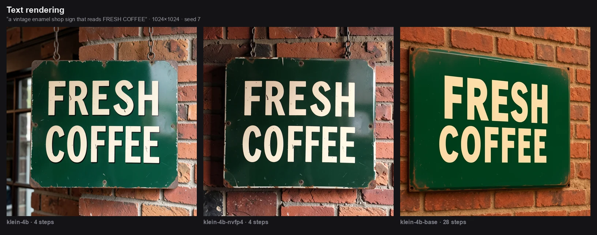
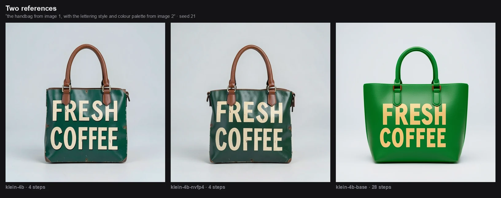
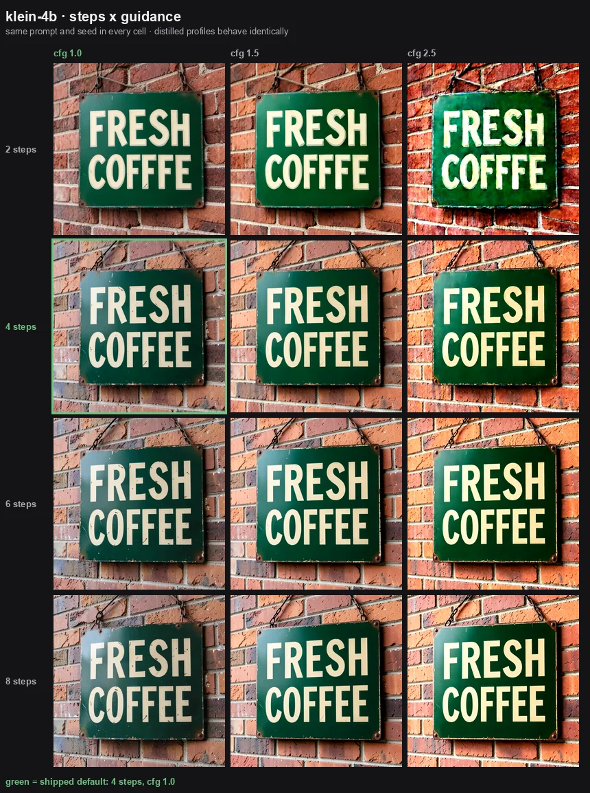
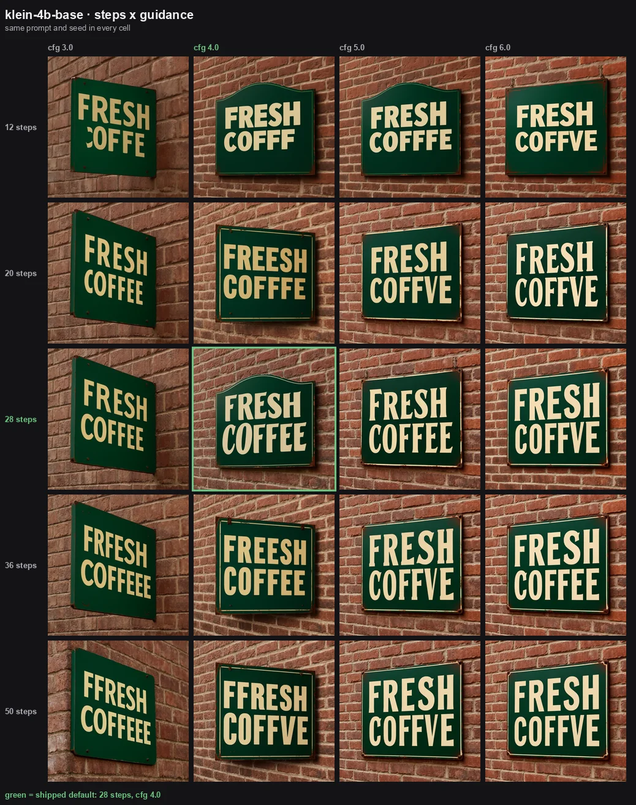

# runpod-worker-flux2

[](https://console.runpod.io/hub/gevondyanerik/runpod-worker-flux2)
[](https://github.com/gevondyanerik/runpod-worker-flux2/actions/workflows/ci.yml)
[](LICENSE)

A [Runpod Serverless](https://docs.runpod.io/serverless/overview) worker for
**FLUX.2 klein 4B** — text-to-image and multi-reference image editing, built on
ComfyUI but with ComfyUI kept entirely out of the API.

Deploy it with **nothing configured** and it works. No API key, no Hugging Face
token, no S3 bucket, no workflow JSON. Send a prompt, get an image.

```bash
curl -X POST https://api.runpod.ai/v2/$ENDPOINT_ID/runsync \
  -H "Authorization: Bearer $RUNPOD_API_KEY" \
  -H "Content-Type: application/json" \
  -d '{"input": {"prompt": "a red bicycle leaning against a white wall"}}'
```

Every model it ships is **Apache-2.0**. Nothing here is under the FLUX
non-commercial licence, which is why the image can be published, redistributed
and used commercially without a separate agreement. See
[Licensing](#licensing).

---

## Contents

- [What it does](#what-it-does)
- [Samples](#samples)
- [Quick start](#quick-start)
- [API](#api)
- [Models](#models)
- [Configuration](#configuration)
  - [How the defaults were chosen](#how-the-defaults-were-chosen)
- [Reference images](#reference-images)
- [Errors](#errors)
- [Hardware](#hardware)
- [Building it yourself](#building-it-yourself)
- [Development](#development)
- [Licensing](#licensing)

---

## What it does

**Text to image.** A prompt and, optionally, a size.

**Image editing with references.** Up to six reference images per request. Each
one conditions the generation, in the order you sent them, so a prompt can say
*"put the logo from image 2 onto the bag in image 1"*. With references and no
explicit size, the output takes its dimensions from the first reference — an
edit of a 3:4 photo comes back as 3:4.

**What it deliberately does not do.** It does not accept workflow JSON, sampler
names, scheduler names, node ids or model paths in a request. Those are
properties of the deployment, not of a call, and exposing them would make every
future change to the graph a breaking API change. If you want a general-purpose
ComfyUI host, use
[worker-comfyui](https://github.com/runpod-workers/worker-comfyui); this worker
is the opposite trade.

---

## Samples

Every image below was produced by this worker, on one RTX PRO 4500 Blackwell,
with each profile's shipped defaults and the same prompt and seed across the
three columns. Nothing is cherry-picked from a batch and nothing is retouched.

### Text to image


### Text rendering



Legible signage is the capability most worth checking before trusting an image
model with a banner. All three spell it here, at each profile's shipped
defaults — which for the base profile means 28 steps, a value the grid search
below picked precisely because higher counts started dropping letters.

### Image editing, one reference


The prompt asked only for the colour to change. Shape, background, lighting
direction, shadow and hardware all survive — that is the property that makes
this useful for product work, where one photograph has to become a dozen
variants of the same object.

### Two references



Subject from the first reference, lettering style and palette from the second.
References condition the generation in the order you send them, so a prompt can
address them positionally.

### What the set shows

- **`klein-4b` is the right default.** At 4 steps it is not a preview tier; it
  is the production output, and across the grid search it was the more
  reliable speller of the three.
- **`klein-4b-nvfp4` is visually near-identical to `klein-4b`** at the same
  seed. It is the small-download option, not the fast one — see
  [Measured](#measured).
- **`klein-4b-base` is a different look, not a strictly better one.** Cleaner
  and more catalogue-like, with less material texture, and slower by more than
  an order of magnitude. Reach for it when prompt adherence matters more than
  throughput, not as a default upgrade.

A handful of seeds is not a benchmark. Treat these as a demonstration that each
path works end to end, and run your own prompts before committing.

---

## Quick start

### From the Runpod Hub

Find **FLUX.2 klein** in the [Hub](https://console.runpod.io/hub) and deploy it.
Every field is optional. The default profile's weights are baked into the
image, so the first cold start does not download anything.

### From this repository

```bash
docker build -t flux2-worker .
```

Then create a Serverless endpoint from that image. The build downloads about
12.5 GB of weights; add `--build-arg BAKE_WEIGHTS=0` to skip that and let the
worker fetch them on first boot instead.

---

## API

### Request

Only `prompt` is required.

| Field | Type | Default | Notes |
|---|---|---|---|
| `prompt` | string | — | Required, 1–8000 characters |
| `images` | string[] | `[]` | Reference images: `https://` URLs or `data:` URIs |
| `width` | int | 1024 | 256–4096, rounded down to a multiple of 16 |
| `height` | int | 1024 | 256–4096, rounded down to a multiple of 16 |
| `n` | int | 1 | Images to generate, up to 4 |
| `steps` | int | profile | 4 for distilled profiles, 20 for base |
| `guidance` | float | profile | 1.0 for distilled, 5.0 for base |
| `seed` | int | random | 0 – 2⁶³−1 |
| `output_format` | string | `webp` | `webp`, `png` or `jpeg` |
| `quality` | int | 95 | 1–100, for WebP and JPEG |

Any other field is rejected rather than ignored, so a typo fails loudly instead
of silently doing something else.

### Response

```json
{
  "images": [
    {
      "b64": "UklGR...",
      "mime_type": "image/webp",
      "seed": 42,
      "index": 0,
      "width": 1024,
      "height": 1024
    }
  ],
  "variant": "klein-4b",
  "width": 1024,
  "height": 1024,
  "steps": 4,
  "guidance": 1.0,
  "reference_count": 0,
  "timings_ms": { "download": 0, "inference": 2140, "upload": 31, "total": 2180 },
  "api_version": "1"
}
```

`width` and `height` are the dimensions of the image that came back, which is
not always what you asked for: dimensions are aligned to the latent grid, and an
edit without an explicit size follows its first reference. When that happens the
response also carries `"adjusted": true`.

With S3 configured, each image carries a `url` instead of `b64`.

### Reproducing a result

One seed covers a whole batch. ComfyUI draws batch noise from a single
generator, so image *i* of a batch of *n* is not the image you get from that
seed with `n=1` — the reproducible unit is `(seed, n, index)`.

### Capabilities

```json
{"input": {"op": "capabilities"}}
```

Returns the active profile, its defaults, and every limit this endpoint
enforces. Because an operator configures almost nothing, this is how an
integrator discovers the limits without a failed request.

---

## Models

Five profiles, all Apache-2.0, all FLUX.2 klein 4B. `FLUX2_VARIANT` picks one;
everything else follows from it.

| `FLUX2_VARIANT` | Precision | Steps | Download | Notes |
|---|---|---|---|---|
| `klein-4b` *(default)* | fp8 | 4 | baked in | Best speed/size balance |
| `klein-4b-bf16` | bf16 | 4 | 7.8 GB | Full-precision reference |
| `klein-4b-nvfp4` | NVFP4 | 4 | 2.5 GB | Blackwell only (compute ≥ 12.0) |
| `klein-4b-base` | fp8 | 28 | 4.1 GB | Slower, stronger prompt adherence |
| `klein-4b-base-bf16` | bf16 | 28 | 7.8 GB | Quality ceiling of this family |

All five share the same Qwen3-4B text encoder and FLUX.2 VAE, both baked into
the image, so switching profiles only downloads a diffusion model.

Every file is pinned by repository revision **and** SHA-256. A profile resolves
to exactly the weights it was tested against, whatever upstream does later, and
a fresh download that does not match its digest is deleted rather than served.

An unknown `FLUX2_VARIANT` fails startup instead of falling back: a typo must
never quietly deploy a different model.

### Measured

One RTX PRO 4500 Blackwell (32 GB), ComfyUI v0.34.0, torch 2.11.0+cu128,
2026-08-29. Inference only, excluding encode and upload. Numbers from one
card on one day — treat them as ratios, not guarantees.

Resolution is ±0.5 s: the worker polls `/history` on a 500 ms interval, so
every timing here is quantised to that. The differences below are several
times larger than the resolution, but a difference of half a second would not
be measurable by this method.

| | 1024² t2i | edit, 1 ref | edit, 2 refs | VRAM in use |
|---|---|---|---|---|
| `klein-4b` (4 steps) | 2.0 s | 3.5 s | 5.0 s | 12.8 GB |
| `klein-4b-nvfp4` (4 steps) | 3.5 s | 6.0 s | 9.3 s | 11.2 GB |
| `klein-4b-base` (28 steps) | 15.1 s | 32.1 s | 53.6 s | 12.8 GB |

Excluding the first image of a run, which carries the model load.

Two things worth reading off that table:

- **NVFP4 is the small option, not the fast one.** It is 75% slower than fp8
  here. Its 2.5 GB download shortens cold starts; its kernels do not shorten
  inference.
- **VRAM barely moves between profiles**, because the bf16 text encoder sets
  the floor. Only `FLUX2_TEXT_ENCODER=fp4` moves it, and it moves it by about
  1.5 GB.
- **The base profile is roughly an order of magnitude slower**, and on a busy
  endpoint a two-reference edit at 54 s is a very different cost model from
  5 s. Budget for it before choosing that profile.

---

## Configuration

**Nothing is required.** The variables below all have working defaults, and no
credential is needed on the default path.

### The one most people set

| Variable | Default | Purpose |
|---|---|---|
| `FLUX2_VARIANT` | `klein-4b` | Which model to serve |

### How the defaults were chosen

Each profile's step count and guidance came out of a grid search on real
hardware, not out of taste. 176 generations: every step count against every
guidance value, three seeds per cell, on two prompts.

The score is deliberately objective. A sign prompt — *“a vintage enamel shop
sign that reads FRESH COFFEE”* — either spells its two words or it does not,
and that can be counted by looking. A product shot ran alongside on the same
grid, so a setting could not win on legibility while quietly ruining
everything else.

#### Distilled profiles: 4 steps, cfg 1.0



| Steps | Legible (of 9) |
|---|---|
| 2 | 6 |
| **4** | **9** |
| 6 | 9 |
| 8 | 9 |

Two steps is not enough; four is. Six and eight spell just as well, cost
proportionally more, and change the composition rather than refine it, so
there is nothing to buy above four. Guidance above 1.0 warms the whole frame —
by cfg 2.5 the brick has gone orange and the lettering glows — which is the
distilled model being pushed outside what it was trained for. `klein-4b-nvfp4`
scored identically and shares these values.

#### Base profiles: 28 steps, cfg 4.0



| Steps | Legible (of 12) |
|---|---|
| 12 | 4 |
| 20 | 6 |
| **28** | **7** |
| 36 | 5 |
| 50 | 4 |

The step axis has a peak and it is not at the end: past 28, spelling gets
*worse*, and 50 steps scored no better than 12 while costing four times as
much. The product-shot grid was effectively flat from 20 steps upward, so
nothing else argues for going higher either. Guidance barely moved the outcome
anywhere between 3.0 and 5.0 — cfg 4.0 sits in the middle of a flat region
rather than on a peak, and 6.0 was slightly worse.

This is why the shipped base default is 28 steps at cfg 4.0 where the official
ComfyUI template says 20 at 5.0 — the only place this worker departs from the
template, and the reason is in the grid above.

Worth being honest about what this measures: three seeds per cell on one
prompt. The seed dominates everything — one of the three spelled correctly in
all 20 base cells, another in only one — so these numbers rank settings, they
do not predict a single request. The base profile is the weaker speller
overall, which is not what the step counts would suggest.

### Sampling steps

`DEFAULT_STEPS` sets the step count for requests that do not carry their own.
Leave it empty and each profile uses its own default — 4 for the distilled
models, 28 for the base ones. A request that sends `steps` overrides it either
way, so this is the endpoint's house default, not a ceiling.

Worth knowing before you raise it on a distilled profile. Measured on the bag
prompt at a fixed seed, 4 → 20 steps did not improve detail or text rendering;
it changed the composition, adding a shoulder strap nobody asked for, and took
2.8x as long. A distilled model is trained to converge in its native step
count, so extra steps buy a different image rather than a better one. The
worker will do it — it is your endpoint — and logs a line at startup saying
what it thinks.

The base profiles are the opposite case: undistilled, so the extra steps are
doing real work, which is why they default to 50.

If what you want is more quality rather than more steps, the profile is the
lever: `klein-4b-base` samples at 28 steps and cfg 4.0, where the extra
compute is doing something the model was trained to use.

`guidance` is deliberately **not** an environment variable. It is a per-request
field, and on a distilled profile the only correct value is 1.0 — cfg 2.5
already oversaturates and cfg 5.0 destroys the image. That is a property of the
model, not a preference, so it stays out of endpoint configuration.

### Endpoint policy

| Variable | Default | Purpose |
|---|---|---|
| `FLUX2_TEXT_ENCODER` | `bf16` | `bf16` (8.0 GB, baked in) or `fp4` (3.8 GB) |
| `MODEL_SOURCE` | `auto` | `auto`, `baked`, `volume` or `download` |
| `DEFAULT_WIDTH` / `DEFAULT_HEIGHT` | 1024 | Used when a request omits them |
| `DEFAULT_STEPS` | *the profile's* | Sampling steps when a request omits them |
| `MAX_PIXELS` | 4194304 | Ceiling on width × height |
| `MAX_IMAGES_PER_REQUEST` | 4 | Upper bound on `n` |
| `MAX_INPUT_IMAGES` | 6 | Can lower the profile's limit, never raise it |
| `REF_MAX_PIXELS` | 1048576 | Pixel budget per reference image |
| `DEFAULT_OUTPUT_FORMAT` | `webp` | `webp`, `png` or `jpeg` |
| `DEFAULT_OUTPUT_QUALITY` | 95 | For WebP and JPEG |

### Optional S3 output

`BUCKET_ENDPOINT_URL`, `BUCKET_ACCESS_KEY_ID`, `BUCKET_SECRET_ACCESS_KEY` — all
three together or none. Leave them empty and images come back as base64, which
is a fully supported production setup, not a degraded one.

### Expert overrides

`DIFFUSION_MODEL_REPO` / `_FILE`, `TEXT_ENCODER_REPO` / `_FILE`, `VAE_REPO` /
`_FILE` point the worker at a different checkpoint without forking it. Set each
pair together. The file must be `.safetensors`; there is no GGUF loader in the
image. `HF_TOKEN` exists only for an override that names a gated repository —
no built-in profile needs it.

Overridden assets carry no pinned digest. The worker can check that your file
arrives, not that it is the right one, and the licence is yours to honour.

### What is deliberately *not* configurable

ComfyUI's host, port and log level; websocket retry counts; model, workflow,
cache and output paths; timeouts; concurrency; sampler and scheduler names;
precision and quantisation settings. Each of these has a correct answer, and
exposing it would only let a deployment break itself.

`app/constants.py` records why for each one, and CI enforces that
`app/config.py` is the only module in the codebase that reads the environment.

---

## Reference images

References arrive as `https://` URLs or `data:` URIs, and are fetched by a
loader written on the assumption that the URL is hostile — because on a public
endpoint it is. It enforces a scheme allowlist, resolves each hostname once and
connects to a validated address (so a second DNS lookup cannot swap in a
private one), re-validates every redirect hop, blocks private, loopback,
link-local and carrier-grade-NAT ranges including cloud metadata at
`169.254.169.254`, unwraps IPv4-mapped IPv6, and enforces a streamed byte
ceiling rather than trusting `Content-Length`.

Each reference is decoded, converted to RGB and downscaled to fit
`REF_MAX_PIXELS`, because references enter the transformer context and their
resolution drives both memory and latency. When one is resized the response
says so under `references` — a silent resize is as dishonest as a silent drop.

Limits: 20 MB per image, 60 MB per request, 3 redirects, 20 s per download and
60 s in total. These are security boundaries, so they are constants rather than
settings.

---

## Errors

Failures return a stable code, a readable message and an honest `retryable`
flag — never a stack trace.

```json
{"error": {"code": "INVALID_RESOLUTION", "message": "…", "retryable": false}}
```

`retryable` is not inferable from the code alone, which is why it is on the
wire: retry `IMAGE_DOWNLOAD_FAILED`, do not retry `INVALID_RESOLUTION`.

| Group | Codes |
|---|---|
| Request | `MISSING_PROMPT`, `INVALID_INPUT`, `INVALID_RESOLUTION`, `TOO_MANY_IMAGES` |
| References | `INVALID_IMAGE_URL`, `IMAGE_DOWNLOAD_FAILED`, `IMAGE_TOO_LARGE`, `TOTAL_INPUT_TOO_LARGE`, `INVALID_IMAGE` |
| Deployment | `UNSUPPORTED_VARIANT`, `UNSUPPORTED_GPU_ARCH`, `MODEL_ASSET_MISSING`, `MODEL_CHECKSUM_MISMATCH`, `MODEL_AUTH_REQUIRED`, `PROFILE_NOT_READY`, `COMFYUI_START_FAILED`, `WORKFLOW_INVALID` |
| Inference | `CUDA_OUT_OF_MEMORY`, `INFERENCE_FAILED`, `INFERENCE_TIMEOUT` |
| Output | `OUTPUT_TOO_LARGE`, `OUTPUT_UPLOAD_FAILED` |

A worker that runs out of memory or loses ComfyUI restarts it, and exits if
that does not help. On serverless a sick worker keeps pulling jobs off the
queue and failing them, which is worse than a dead one: the platform replaces a
dead worker.

---

## Hardware

The bf16 text encoder is 8.0 GB, and it sets the memory floor for **every**
profile. Choosing fp8 over bf16 buys download size and load time, not a smaller
GPU. `FLUX2_TEXT_ENCODER=fp4` is the only setting that lowers the floor.

- **Recommended:** 24 GB (RTX 4090, L4, A5000, L40S, A6000)
- **Minimum:** 16 GB, with smaller outputs and fewer references
- **`klein-4b-nvfp4`:** Blackwell only. On anything older the worker refuses to
  start rather than running slowly and silently.

Startup checks the GPU before downloading anything and prints what it found.
Memory warnings do not block startup: an estimate that refused to run would
make this worker impossible to deploy on hardware it may well handle.

---

## Building it yourself

```bash
docker build -t flux2-worker .                                  # default, weights baked
docker build -t flux2-worker --build-arg BAKE_WEIGHTS=0 .       # no weights
docker build -t flux2-worker --build-arg BAKE_VARIANT=klein-4b-base .
docker build -t flux2-worker --build-arg BAKE_TEXT_ENCODER=fp4 .
```

`BAKE_VARIANT` also writes `FLUX2_BAKED_VARIANT` into the image, so a privately
rebuilt image still starts correctly with an empty environment.

Each release also publishes a prebuilt image with the default profile's weights
already in it:

```
ghcr.io/gevondyanerik/runpod-worker-flux2:latest
```

The Hub builds its own image from this Dockerfile, so that tag is for people
deploying the worker outside the Hub.

Base image, ComfyUI revision and torch build are all pinned. "Whatever was
latest when this layer was rebuilt" is not a reproducible deployment.

---

## Development

Everything except the Docker build runs on a laptop with no GPU and no network.

```bash
python -m venv .venv && source .venv/bin/activate
pip install -r requirements-dev.txt

pytest tests -q                  # ~175 tests, about a second
ruff check . && ruff format --check .
mypy app bootstrap

python scripts/audit_config.py   # only app/config.py reads the environment
python scripts/audit_env.py      # .env.example and hub.json match the code
python scripts/check_assets.py   # the pinned model files still exist (network)
```

The whole request path is exercised against `tests/fake_comfy.py`, a ComfyUI
stand-in with failure injection, so recovery behaviour is tested rather than
hoped for. The generated graphs are pinned by golden files; regenerate them
deliberately with `python scripts/update_goldens.py` and review the diff.

On a real GPU:

```bash
python scripts/diagnose.py                    # why won't this worker start
python scripts/benchmark.py --emit-probes     # measured VRAM and latency
python scripts/smoke_test.py $ENDPOINT_ID     # against a deployed endpoint
```

`docs/design.md` explains the decisions behind the shape of this worker.

---

## Licensing

This worker is Apache-2.0. So is every model it ships:

| Component | Licence |
|---|---|
| This code | Apache-2.0 |
| FLUX.2 klein 4B (all five profiles) | Apache-2.0 |
| Qwen3-4B text encoder | Apache-2.0 |
| FLUX.2 VAE | Apache-2.0 |
| ComfyUI | GPL-3.0 (run as a separate process, not linked) |

**FLUX.2-dev and the klein 9B family are deliberately absent.** They are
released under the FLUX Non-Commercial Licence, which excludes revenue-
generating activity and any use with impact on end users. Baking those weights
into a public image would be distribution under that licence, with obligations
this project cannot make on your behalf. Keeping the registry Apache-only means
there is no licence gate to get wrong: anything you can deploy from here, you
can use commercially.

If you point an expert override at other weights, their licence is yours to
honour.
